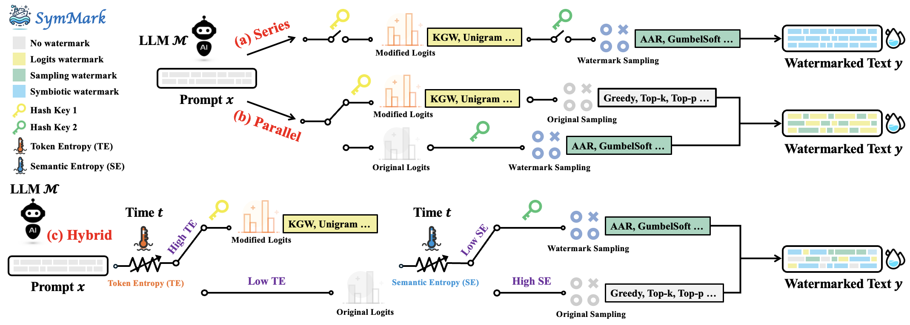

# From Trade-off to Synergy: A Versatile Symbiotic Watermarking Framework for Large Language Models

> This repository contains the official code implementation of our paper: [](https://arxiv.org/abs/xxx)



## Setup

First, create a virtual environment using Anaconda:

```python
conda create -n symmark python=3.10
conda activate symmark
```

Second, you need to install the necessary dependencies:

```python
pip install -r requirements.txt
```

## Datasets

You can download datasets such as C4 and OpenGen from [here](https://drive.google.com/drive/folders/1Rjc_6ERdChR-XRC5KwxeqOh4jU46K_4n), and place them under the `./data` directory.

## Usage

You can implement our watermark embedding and extraction process by following these steps:

0. Modify the `mode` in `run.sh` to specify whether to embed a watermark (`train`) or extract it (`test`).

1. Customize the watermark by adjusting various hyperparameters in the `run.sh` file:
   - `watermark_type`: Specifies the type of semantic watermark to use (`S`, `H`, `I`, or `P`).
   - `dataset_name` and `dataset_size`: Determine the type and size of the dataset.
   - `target_model_name`: Specifies which target model to use for watermark text generation.
   - `attack_method`: Used to evaluate the robustness of the watermarking method.
   - `text_source`: Determines whether the source text is generated by humans or machines.
2. Run the command `bash run.sh` to embed or verify the watermark.

Additionally, for watermark stealing attack, please refer to https://github.com/eth-sri/watermark-stealing.

## Acknowledgements

Our SymMark framework is based on [MarkLLM](https://github.com/THU-BPM/MarkLLM). We thank the team for their open-source implementation.
